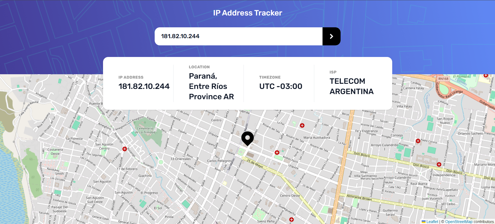

# Frontend Mentor - IP address tracker solution

This is a solution to the [IP address tracker challenge on Frontend Mentor](https://www.frontendmentor.io/challenges/ip-address-tracker-I8-0yYAH0). Frontend Mentor challenges help you improve your coding skills by building realistic projects.

## Table of contents

- [Overview](#overview)
  - [The challenge](#the-challenge)
  - [Screenshot](#screenshot)
  - [Links](#links)
- [My process](#my-process)
  - [Built with](#built-with)
  - [What I learned](#what-i-learned)
- [Author](#author)

## Overview

### The challenge

Users should be able to:

- View the optimal layout for each page depending on their device's screen size
- See hover states for all interactive elements on the page
- See their own IP address on the map on the initial page load
- Search for any IP addresses or domains and see the key information and location

### Screenshot

### Links

- Solution URL: [https://github.com/nahuelcaputto/ip-address-tracker](https://github.com/nahuelcaputto/ip-address-tracker)
- Live Site URL: [https://nahuelcaputto.github.io/ip-address-tracker/](https://nahuelcaputto.github.io/ip-address-tracker/)

## My process

### Built with

- Semantic HTML5 markup
- CSS custom properties
- Flexbox
- CSS Grid
- Mobile-first workflow
- [React](https://reactjs.org/) - JS library
- [Vite](https://vitejs.dev/) - Frontend build tool
- [Leaflet](https://leafletjs.com/) - For map
- [Tailwind CSS](https://tailwindcss.com/) - Utility-first CSS framework

### What I learned

This project was my first experience using **Vite** as a build tool, allowing me to work with a fast development server, efficient hot module replacement, and a simplified configuration workflow.

It was also my first time working with **Leaflet**, where I learned how to integrate interactive maps into a React application, manage map state, and update markers dynamically based on external data.

Additionally, I used the **Geo.IPify API** to fetch geolocation data from IP addresses, gaining experience in consuming third-party APIs, handling asynchronous data, and connecting API responses to UI updates.

Finally, I reinforced my existing knowledge of **React** and **Tailwind CSS**, focusing on component-based architecture and responsive, utility-first styling.

## Author

- Github - [Nahuel Caputto](https://github.com/nahuelcaputto)
- Frontend Mentor - [@nahuelcaputto](https://www.frontendmentor.io/profile/nahuelcaputto)
- LinkedIn - [@nahuel-caputto](https://www.linkedin.com/in/nahuel-caputto/)
